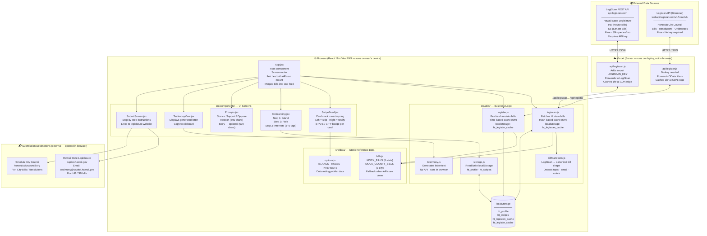

# HawaiiTestify — Architecture Overview

Built with Claude Code + Vercel · 2026

---

## System Diagram



---

## Data Flow — Step by Step

### On App Load
```
App.jsx
  ├── Promise.all([fetchHawaiiBills(), fetchHonoluluBills()])
  │     │
  │     ├── fetchHawaiiBills()  [src/utils/legiscan.js]
  │     │     ├── Check localStorage (ht_legiscan_cache) → fresh? return cached bills
  │     │     ├── GET /api/legiscan?op=getSearch&state=HI   [1 API query]
  │     │     │     └── api/legiscan.js adds LEGISCAN_KEY → forwards to api.legiscan.com
  │     │     ├── Compare change_hash for each bill to cached hashes
  │     │     ├── GET /api/legiscan?op=getBill&id=X  (only for changed bills, max 10)
  │     │     ├── transformBill()  [src/utils/billTransform.js]
  │     │     └── Store in localStorage → return 8 bills
  │     │
  │     └── fetchHonoluluBills()  [src/utils/legistar.js]
  │           ├── Check localStorage (ht_legistar_cache) → fresh? return cached bills
  │           ├── GET /api/legistar?path=matters&$filter=MatterStatusName eq 'In Committee'
  │           │     └── api/legistar.js forwards to webapi.legistar.com/v1/honolulu/
  │           ├── transformMatter() (inline in legistar.js)
  │           └── Store in localStorage → return 5 bills
  │
  └── setBills([...stateBills, ...countyBills])
        └── SwipeFeed receives 13 merged bills
              └── Bills matching user's interests sorted to front of stack
```

### User Testimony Flow
```
SwipeFeed  →  (swipe right)  →  Prompts  →  TestimonyView  →  SubmitScreen
               selectedBill         ↓               ↓
                              {stance,          generateTestimony()
                               reason,          [testimony.js]
                               story}           → plain text letter
                                                → copy to clipboard
                                                          ↓
                                                  capitol.hawaii.gov
                                                  (or city council site)
```

---

## File Map

```
hawaii-testify/
│
├── api/                          ← Vercel serverless functions (run on server)
│   ├── legiscan.js               ← Proxy to LegiScan (adds secret API key)
│   └── legistar.js               ← Proxy to Legistar (no key needed)
│
├── src/
│   ├── App.jsx                   ← Root: screen router + state + parallel fetch
│   ├── main.jsx                  ← React entry point
│   │
│   ├── components/               ← One file per screen
│   │   ├── Onboarding.jsx        ← Island → Role → Interests (first visit only)
│   │   ├── SwipeFeed.jsx         ← Card swipe UI with STATE/CITY badges
│   │   ├── Prompts.jsx           ← Stance + reason + story inputs
│   │   ├── TestimonyView.jsx     ← Generated letter + copy button
│   │   └── SubmitScreen.jsx      ← How-to-submit instructions + links
│   │
│   ├── utils/                    ← Business logic, no JSX
│   │   ├── legiscan.js           ← State bill fetcher + 6hr cache
│   │   ├── legistar.js           ← County bill fetcher + 6hr cache
│   │   ├── billTransform.js      ← LegiScan raw JSON → canonical bill shape
│   │   ├── testimony.js          ← Letter generator (template-based, no API)
│   │   └── storage.js            ← localStorage helpers (profile + swipes)
│   │
│   └── data/                     ← Static data, no fetching
│       ├── bills.js              ← Mock fallback bills (state + county)
│       └── options.js            ← Islands, roles, interests for onboarding
│
├── ARCHITECTURE.md               ← This file
├── NOTES.md                      ← Build notes, API keys, deployment info
├── package.json
└── vite.config.js
```

---

## Government Levels Explained

| Level | Body | What it covers | Bills | Where to testify |
|-------|------|---------------|-------|-----------------|
| **State** | Hawaii State Legislature | Statewide laws — taxes, education, healthcare, environment, criminal law | HB (House), SB (Senate) | capitol.hawaii.gov |
| **County** | Honolulu City Council | Oʻahu-specific — zoning, property rules, TheBus/rail, parks, local fees | Bill, Resolution, Ordinance | honolulucitycouncil.org |
| **City Service** | Honolulu 311 (SeeClickFix) | Report potholes, broken lights, trash — NOT legislation | N/A | 311.honolulu.gov |

> **Which affects your daily life most?**
> County (City Council) bills tend to have the most immediate impact — your rent rules, your neighborhood zoning, whether the bus route near you gets funded. State bills are broader and slower to feel but matter for big-picture issues like education and healthcare.

---

## Data Source Quick Reference

| Source | URL | Auth | What it returns | Used by |
|--------|-----|------|----------------|---------|
| LegiScan API | `https://api.legiscan.com/` | API key (env var `LEGISCAN_KEY`) | HI state HB/SB bills | `api/legiscan.js` |
| Legistar API | `https://webapi.legistar.com/v1/honolulu/` | None (public) | Honolulu City Council bills | `api/legistar.js` |
| Hawaii Legislature (submit) | `https://www.capitol.hawaii.gov/` | None | Testimony submission portal | `SubmitScreen.jsx` |
| Honolulu City Council (submit) | `https://honolulucitycouncil.org/` | None | City Council testimony portal | `SubmitScreen.jsx` (future) |
| Honolulu Legistar portal | `https://honolulu.legistar.com/` | None | Public bill detail pages | Bill `stateLink` for county bills |
